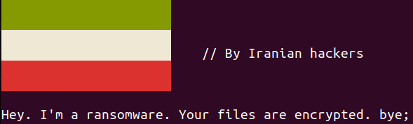

# Kokosabzi
Kokosabzi is a c++ ransomware that currently works on linux-based OSs.

[](resources/scr.png "screenshot")

## Disclaimer
Kokosabzi is just for educational purposes. Responsibilities of any illegal usage of source code or pre-built binary files is on yours.

### Information
C++ Version: **17**
Encryption algorithm: **AES, CBC mode**
Decryptable: **No (currently)**
Ransom acception: **No (currently)**

### Compile
If you want to compile source code by your own, you can make it done using g++ directly:
```bash
g++ -o bin/kokosabzi kokosabzi.cpp -I libs/aes256 libs/aes256/AES.cpp -std=c++17 -lssl -lcrypto
```
Or you can run python script called `compiler.py` which runs the exact same top command:
```bash
python3 compiler.py
```